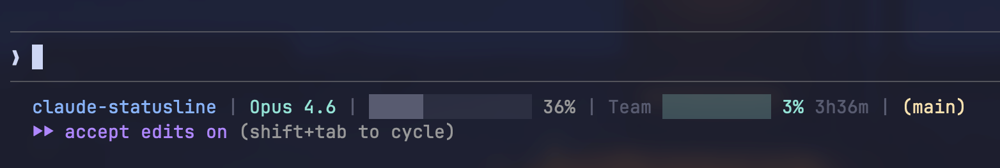

# claude-statusline

A real-time statusline for [Claude Code](https://docs.anthropic.com/en/docs/claude-code) that shows usage quota, context window, git status, and more — right in your terminal.



## Install

```bash
curl -fsSL https://raw.githubusercontent.com/educlopez/claude-statusline/main/install.sh | bash
```

The installer shows an interactive menu where you pick which modules to enable:

```
Claude Statusline — Choose your modules:

  [x] 1) Directory      my-project
  [x] 2) Model          Opus 4.6
  [x] 3) Context        ░░░░░░░░░░░░░░░ 12%
  [x] 4) Usage quota    Max ██████░░░░ 58% 3h42m
  [x] 5) Git status     (main | 3 files +42 -8)

  Toggle: enter number (e.g. 4). Accept: Enter. All: a
```

Then restart Claude Code.

### Install options

```bash
# Force reinstall (overwrites existing script + config)
curl -fsSL .../install.sh | bash -s -- --force

# Skip menu — install all modules
curl -fsSL .../install.sh | bash -s -- --all

# Skip menu — pick specific modules
curl -fsSL .../install.sh | bash -s -- --modules=model,context,usage

# Combine flags
curl -fsSL .../install.sh | bash -s -- --force --modules=context,usage,git
```

### Change modules later

Re-run the installer with `--force`, or edit `~/.claude/.statusline-config.json` directly:

```json
{
  "modules": ["directory", "model", "context", "usage", "git"]
}
```

Remove any module from the array to hide it.

## Modules

| Module | What it shows |
|--------|---------------|
| `directory` | Current project folder name |
| `model` | Active model (Opus 4.6, Sonnet 4.6, etc.) |
| `context` | Context window progress bar + percentage |
| `usage` | 5h quota bar, reset timer, plan badge (Pro/Max/Team), 7d warning |
| `git` | Branch name, changed files count, lines added/removed |

## Features

- **Modular** — pick only the sections you want
- **Context window** — progress bar + percentage of context used
- **Usage quota** — 5-hour utilization with color-coded bar (Pro/Max/Team)
- **Reset timer** — countdown to when your 5h quota resets
- **7-day warning** — shows weekly utilization when above 70%
- **Git status** — branch name, changed files count, lines added/removed
- **Plan badge** — shows your subscription tier (Pro, Max, Team)
- **Smart caching** — usage data cached for 60s, refreshed in background
- **Cross-platform** — works on macOS, Linux, and WSL

## Color coding

| Usage level | Color |
|-------------|-------|
| 0-49% | Cyan |
| 50-74% | Yellow |
| 75-89% | Magenta |
| 90%+ | Red |

## Requirements

- [Claude Code](https://docs.anthropic.com/en/docs/claude-code) CLI
- `jq` — JSON processor ([install](https://jqlang.github.io/jq/download/))
- `curl` — HTTP client (pre-installed on most systems)
- `bash` 3.2+ (pre-installed on most systems)

## How it works

1. Claude Code pipes JSON context (model, workspace, context window) to the script via stdin
2. The script reads `~/.claude/.statusline-config.json` to know which modules are enabled
3. For the usage module: reads OAuth credentials from `~/.claude/.credentials.json` to fetch quota data from the Anthropic API
4. Usage data is cached locally (`~/.claude/.usage-cache/usage.json`) for 60 seconds to avoid blocking the statusline
5. Git info is gathered from the current workspace directory
6. Only enabled modules are rendered into the final colorized line

## Multi-account setup

If you use `CLAUDE_CONFIG_DIR` to manage multiple accounts, the statusline respects it:

```bash
CLAUDE_CONFIG_DIR=~/.claude-work claude
```

The installer also respects `CLAUDE_CONFIG_DIR` — run it with the variable set to install for a specific account. Each account gets its own module config.

## Compatibility

| Platform | Status |
|----------|--------|
| macOS | Supported |
| Linux | Supported |
| WSL | Supported |
| Windows (native) | Not supported |

## Uninstall

```bash
curl -fsSL https://raw.githubusercontent.com/educlopez/claude-statusline/main/uninstall.sh | bash
```

This removes the statusline script, module config, the `statusLine` key from your settings, and the usage cache directory.

## License

MIT

## Inspired by

- [claude-hud](https://github.com/rysana-ai/claude-hud) — the original Claude Code HUD concept
